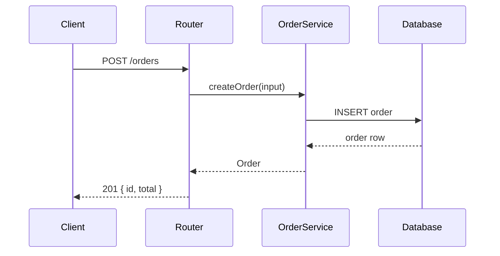
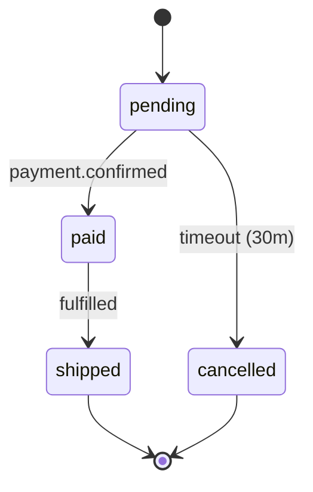

# Explain

Teach the user how the code they pointed at actually works.

The goal is **understanding**, not a summary. A summary tells the user what the code does; teaching makes them able to predict what it will do next time. That difference is the entire skill.

## The Contract

- **Read-only.** Do not refactor, do not "improve while explaining". The user asked to understand this code as it is.
- **Trace, do not paraphrase.** Follow the real execution path through real files. Naming a function and describing it in the abstract is a summary, not an explanation.
- **Answer at the user's level.** Match their demonstrated vocabulary. Do not explain a `for` loop to someone reading a React compiler, and do not hand-wave over closures to someone who has not met them.
- **Say when you are unsure.** If the flow depends on runtime state you cannot see, say which state and what it would change. A confident wrong mental model is worse than an admitted gap.

## Phase 1 — Establish What to Explain

The user's pointer may be a file, a function, a line, a stack trace, or a concept. Resolve it to a concrete subject.

| The user gave                         | Resolve to                                                 |
| ------------------------------------- | ---------------------------------------------------------- |
| A file path                           | The file's role, plus its entry point and its callers      |
| A function or method name             | Its signature, its body, and every call site               |
| A single line or a selection          | The enclosing statement, then outward to the function      |
| A stack trace                         | The frames in the project, walked from the throw site up   |
| A concept ("how does auth work here") | The end-to-end path across files                           |
| "This file is confusing"              | Ask which part, or explain the flow and let them interrupt |

Read the subject in full before writing a word. Then read **outward**: the callers, the callers' callers, and the data the code consumes.

```bash
grep -rn "functionName" --include='*.ts' --include='*.py' --include='*.php' . 2>/dev/null | head -20
```

If the user did not say how deep to go, default to one level of callers and one level of callees. Offer to go deeper.

## Phase 2 — Build the Flow Before Explaining It

You cannot explain a flow you have not traced. Establish four things:

1. **Entry** — where does execution start? An HTTP handler, a CLI argument, a component render, an event, a job.
2. **Transform** — what happens to the data at each step? Name the shape going in and the shape coming out.
3. **Decision points** — every branch that changes the path, and what triggers it.
4. **Exit** — where does it end? A return value, a render, a database write, an emitted event.

Write this as a chain before writing prose. If you cannot write the chain, you do not yet understand the code well enough to teach it — go read more.

```
POST /orders
  → router (src/routes/orders.ts:14)
  → validate(body)  → OrderInput | ValidationError
  → priceOrder(items)  → { subtotal, tax, total }
  → db.insert(orders)  → Order row
  → queue.publish("order.created")  → void
  → 201 { id, total }
```

That chain is the skeleton of the whole explanation. Everything else hangs off it.

## Phase 3 — Choose the Teaching Device

Pick the device that fits the concept. Do not use all of them; a wall of analogies teaches nothing.

| The code is…                               | Explain it with                                                            |
| ------------------------------------------ | -------------------------------------------------------------------------- |
| A sequence of steps                        | A numbered walkthrough of the real chain, with the actual values           |
| A data structure                           | A concrete example with real values, shown before and after each operation |
| A branch or state machine                  | A diagram of the states and the transitions                                |
| An abstraction (interface, DI, middleware) | A physical analogy, then the real mechanism it maps to                     |
| Async or concurrent                        | A timeline showing what overlaps and what waits                            |
| A performance trick                        | The naive version, then this version, then the measurement                 |
| A bug or surprising behavior               | The mental model the reader probably has, then where it breaks             |

### Analogies: use them, then retire them

An analogy is scaffolding. State it, use it, then explicitly drop it, because every analogy is wrong somewhere and an unretired one becomes a misconception.

> Think of the middleware stack like a queue at a security desk: each guard inspects you and either waves you through to the next guard or turns you back. **Where this breaks:** unlike a real queue, a middleware can rewrite your request before passing it on, and can act again on the way out.

The "where this breaks" sentence is what separates teaching from hand-waving.

### Diagrams: keep them small and true

Use a Mermaid diagram when there is a flow, a state machine, or a sequence. Do not diagram a straight line — that is a list.



For a state machine:



A diagram earns its place when it shows something prose cannot: a branch, a loop, a parallel path, or a cycle.

## Phase 4 — Write the Explanation

Use this structure. Scale each section to the subject; a 20-line function needs a shorter explanation than a payment pipeline.

### 1. In one sentence

What this code does, for someone who will read no further.

> `priceOrder` turns a list of line items into a total by applying per-item discounts, then tax, in that order.

### 2. The flow

The traced chain from Phase 2, annotated with the real file and line for each step. This is the core of the explanation.

### 3. The interesting part

Every piece of code has one part that is genuinely non-obvious: the trick, the ordering that matters, the invariant being preserved, the workaround for an external constraint. Identify it and spend your effort there. Skip the boilerplate.

If the ordering matters, say **why** it matters:

> Discounts apply before tax, not after. Applying tax first would tax the discounted amount and under-collect — the tax authority requires tax on the pre-discount price.

### 4. Where else this pattern appears

Connect it to the rest of the codebase and to the wider craft. This is what turns a one-off explanation into transferable knowledge.

> The same middleware-composition pattern appears in `src/middleware/auth.ts` and `src/middleware/logging.ts` — all three register into the same chain in `src/app.ts:31`.

### 5. What would break it

The boundaries of the mental model. This is where the user learns what to watch for.

> This assumes `items` is non-empty — `Math.max(...totals)` on an empty array returns `-Infinity`. The caller in `src/routes/orders.ts:19` validates length first, so it is safe today, but a new caller could break it.

### 6. Check your understanding

Two or three questions the user can answer to test their model. Not a quiz for its own sake — these are the questions that reveal whether the model is real.

> - If a discount is 100%, what does the order total?
> - Why does `priceOrder` not write to the database itself?

Offer the answers, collapsed or on request.

## Calibrating Depth

Read the user's vocabulary from the question and match it.

| The user's phrasing suggests      | Start at                                                                  |
| --------------------------------- | ------------------------------------------------------------------------- |
| "what does this line do"          | Line-level; assume the surrounding context is understood                  |
| "how does this work"              | Function-level flow, with the data shapes                                 |
| "why is this like this"           | Design rationale; the alternatives and the constraint that chose this one |
| "I'm new to this codebase"        | Entry point first; define project-specific terms                          |
| "explain like I'm five"           | Analogy-first, mechanism second, jargon last                              |
| "I know X, what's different here" | Contrast against X; skip what is shared                                   |

When unsure, explain the mechanism and offer a deeper or shallower pass. Do not front-load three paragraphs of background the user may already have.

## Tone

- **Second person, direct.** "You call `createOrder` and it…" not "One would invoke…".
- **Concrete over abstract.** Real values, real paths, real line numbers.
- **No condescension and no flattery.** Not "Great question!" and not "Obviously, …".
- **Define a term the first time it appears**, if it is project-specific or genuinely obscure. Do not define `array`.
- **Name the tradeoff.** Every design has one. Explaining code without its tradeoff teaches the shape but not the judgment.

## Common Mistakes

| Mistake                                     | Why It Breaks                                                       | Correct Approach                                     |
| ------------------------------------------- | ------------------------------------------------------------------- | ---------------------------------------------------- |
| Paraphrasing the code line by line          | The user can read the code; they need the model                     | Explain the flow and the why                         |
| Not tracing the flow                        | Produces a plausible description of code that does not run that way | Follow the real call chain first                     |
| Refactoring while explaining                | Answers a question nobody asked; the user loses the original        | Read-only                                            |
| An analogy without its limit                | Becomes a misconception the user carries forward                    | Always say where the analogy breaks                  |
| Diagramming a straight line                 | A diagram that restates a list adds no information                  | Diagram branches, loops, and cycles                  |
| Explaining every line equally               | The boilerplate buries the interesting part                         | Find the non-obvious part and spend the effort there |
| Assuming too much or too little             | Either condescending or confusing                                   | Calibrate from the user's phrasing                   |
| No concrete values                          | Abstraction without an example does not stick                       | Walk a real input through                            |
| Skipping "what would break it"              | The model has invisible edges                                       | State the assumptions and boundaries                 |
| Claiming certainty about runtime state      | A confident wrong model is worse than a gap                         | Name what you could not determine                    |
| Explaining the language instead of the code | Teaches `async` to someone asking about `createOrder`               | Explain this code; link out for general concepts     |
