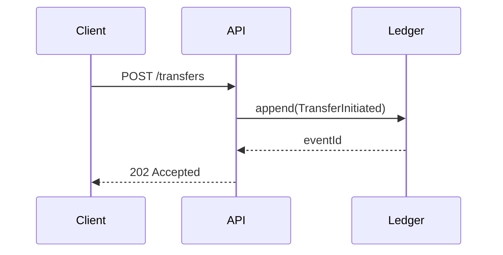

# Documentation and Code Comment Standards

Comments and docs are the only artifacts in a codebase that no compiler, test, or type checker verifies. They decay silently: a stale comment that contradicts the code is worse than no comment, because the next engineer trusts prose over the implementation. Documentation drift is how a team ships a security fix that the README still describes as optional, or an API reference that documents a parameter removed two majors ago.

## Contents

- [When This Applies](#when-this-applies)
- [The Default Is No Comment](#the-default-is-no-comment)
  - [Naming carries the documentation load](#naming-carries-the-documentation-load)
- [When a Comment Is Warranted](#when-a-comment-is-warranted)
  - [Comments that carry real information](#comments-that-carry-real-information)
  - [Comments that are pure noise](#comments-that-are-pure-noise)
  - [TODO / FIXME / HACK conventions](#todo--fixme--hack-conventions)
  - [Keep comments in the codebase's language](#keep-comments-in-the-codebases-language)
- [Docstrings on Public APIs](#docstrings-on-public-apis)
  - [JSDoc / TSDoc (JavaScript, TypeScript)](#jsdoc--tsdoc-javascript-typescript)
  - [Google-style Python](#google-style-python)
  - [Go doc comments](#go-doc-comments)
  - [Javadoc and C# XML doc comments](#javadoc-and-c-xml-doc-comments)
- [Repository Documentation](#repository-documentation)
  - [README structure](#readme-structure)
  - [CONTRIBUTING and CODEOWNERS](#contributing-and-codeowners)
  - [Keep docs next to the code](#keep-docs-next-to-the-code)
  - [ADRs for irreversible decisions](#adrs-for-irreversible-decisions)
- [Diagrams, Checks, and Drift Prevention](#diagrams-checks-and-drift-prevention)
  - [Diagrams as text](#diagrams-as-text)
  - [CI checks that stop drift](#ci-checks-that-stop-drift)
  - [Avoid documentation that duplicates code](#avoid-documentation-that-duplicates-code)
- [Common Mistakes](#common-mistakes)
- [Checklist](#checklist)
- [References](#references)

## When This Applies

- Auditing a repo for comments that restate code (`// increment i by one`), changelog-style comments (`// added 2024-03-11`), or commented-out blocks kept "just in case".
- Unifying docstring styles across a mixed codebase (some JSDoc, some bare `//`, some Python `#` blocks above `def`).
- Adding or restructuring a README, `CONTRIBUTING.md`, `CODEOWNERS`, or an `adr/` directory.
- Public library surfaces where consumers read generated API reference, not source.
- Onboarding friction traced to "we can't tell why this exists" — missing ADRs or missing _why_ comments on workarounds.
- CI has no spell check, link check, or docs build, and docs rot is already visible in the repo.
- A PR review disputes a comment's accuracy, or a comment is the sole justification for a non-obvious branch.

## The Default Is No Comment

Self-documenting code is not a slogan; it is a concrete set of refactors. Every comment you delete must be replaced by a structural change that makes the comment unnecessary.

| What the comment says                            | Structural replacement                                                     |
| ------------------------------------------------ | -------------------------------------------------------------------------- |
| `// check if user is active and has a paid plan` | `if (user.isActiveAndPaid())` — extract a predicate named for the question |
| `// loop over orders and sum totals`             | `const grandTotal = sumLineTotals(orders)`                                 |
| `// 86400 seconds in a day`                      | `const SECONDS_PER_DAY = 86_400`                                           |
| `// returns null if not found`                   | Type it: `findUser(id: UserId): User \| null`                              |
| `// handles the Stripe webhook`                  | Name the function `handleStripeWebhook`                                    |
| `// this is a big function, see below`           | Split it; the split _is_ the documentation                                 |

A comment that explains _what_ the next line does is a failed naming decision. Refactor, then delete.

### Naming carries the documentation load

```typescript
// before: comment does the work
// returns true if the token expires within the refresh window
function check(t: Token): boolean {
  return t.expiresAt - Date.now() < REFRESH_WINDOW_MS;
}

// after: signature does the work, comment is gone
function isWithinRefreshWindow(token: Token): boolean {
  return token.expiresAt - Date.now() < REFRESH_WINDOW_MS;
}
```

```go
// before
// retry up to 3 times with backoff
func do(c *Client, req *Request) (*Response, error) { ... }

// after
func (c *Client) DoWithRetry(req *Request, maxAttempts int) (*Response, error) { ... }
```

Small functions with explicit types mean the reader never needs the prose. Reserve prose for the residue that naming cannot carry.

## When a Comment Is Warranted

A comment earns its place only when it records something the code _cannot_ express: an external constraint, a non-obvious reason, a hazard, or a pointer to a spec. The test is simple — if you deleted the comment, could a competent engineer reconstruct it by reading the code and the surrounding types? If yes, delete it.

### Comments that carry real information

| Category              | Example content                                                                | Why code cannot express it                                 |
| --------------------- | ------------------------------------------------------------------------------ | ---------------------------------------------------------- |
| Workaround            | "Postgres 14 planner picks a seq scan here; force the index until 15 lands"    | Encodes an external system's behavior and a deadline       |
| External constraint   | "Stripe requires the idempotency key to be the raw body hash, not the payload" | Third-party contract, invisible in types                   |
| Security rationale    | "Constant-time compare; a short-circuit leaks token length"                    | Explains why the obvious implementation is a vulnerability |
| Performance trade-off | "Allocating here costs ~4ms p99; the reuse buffer is deliberate"               | Measured fact, not derivable from source                   |
| Spec/issue link       | "See RFC 7231 §6.5.4" / "closes #4182"                                         | Points outside the repo                                    |
| Non-obvious ordering  | "Must close the writer before the reader or the goroutine leaks"               | Invariant across two distant lines                         |

```python
def verify_token(provided: bytes, expected: bytes) -> bool:
    """Compare in constant time to avoid leaking the token prefix via timing."""
    return hmac.compare_digest(provided, expected)
```

```typescript
// BigInt is required: the ledger sums exceed Number.MAX_SAFE_INTEGER.
const total = rows.reduce((acc, r) => acc + BigInt(r.amountMinor), 0n);
```

Both comments answer _why_, never _what_. The code already says what.

### Comments that are pure noise

- Restating the line: `i++ // increment i`.
- Changelog in source: `// 2024-03-11 - JMR - added retry`.
- Commented-out code — delete it; version control is the archive.
- Decorative banners: `// ====== HELPERS ======`. Use a module boundary instead.
- Section markers in a file that should be three files.
- Auto-generated `@author`/`@date` headers that no one updates.
- "TODO" with no owner, no issue, and no date — it is an unbounded liability.

### TODO / FIXME / HACK conventions

Every marker must name an owner and a tracked issue, or it will outlive the person who wrote it. Enforce a pattern in CI:

```text
TODO(#4182): migrate to the v2 pagination cursor — owner @dana, remove by 2026-Q2
FIXME(#4410): race when two writers share the session row — owner @kev
HACK(#3901): parse HTML with regex because the vendor has no JSON endpoint — owner @sam
```

```bash
# fail CI when a marker lacks an issue reference
! grep -rnE '(TODO|FIXME|HACK|XXX)(?!\(#[0-9]+\))' --include='*.ts' --include='*.py' --include='*.go' .
```

Prefer a linter rule to a bespoke grep where the ecosystem has one — ESLint's `no-warning-comments`, Ruff's `TD` (`flake8-todos`) rules with `task-tags`, or `golangci-lint`'s `godox` — because they also catch the marker in languages your grep misses.

### Keep comments in the codebase's language

A comment in a language the team does not speak is unmaintainable. If the repo's prose is English, comments are English — including non-Latin scripts, which editors render inconsistently and diff poorly. This is a convention to _detect and normalize_, not to introduce: match the existing dominant language rather than imposing one.

## Docstrings on Public APIs

Document the public surface. Private helpers get a docstring only when their contract is non-obvious. A docstring covers purpose, parameters, return, raised errors, and at least one usage example — in the style the ecosystem expects, because tooling parses it.

### JSDoc / TSDoc (JavaScript, TypeScript)

```typescript
/**
 * Resolve a user by their external identity provider subject.
 *
 * @param subject - The OIDC `sub` claim, stable per provider.
 * @returns The matching user, or `null` when no account is linked.
 * @throws {RateLimitError} When the identity provider rejects the lookup.
 * @example
 * const user = await findUserBySubject('auth0|64f2c1');
 */
export async function findUserBySubject(subject: string): Promise<User | null>;
```

### Google-style Python

```python
def transfer_funds(source_id: str, dest_id: str, amount_minor: int) -> Receipt:
    """Move funds between two accounts in a single transaction.

    Args:
        source_id: Account to debit.
        dest_id: Account to credit.
        amount_minor: Amount in the currency's minor unit (cents).

    Returns:
        The settlement receipt, including the generated transfer id.

    Raises:
        InsufficientFundsError: If the source balance is below ``amount_minor``.
        AccountFrozenError: If either account is not in an active state.

    Example:
        >>> transfer_funds('acct_a', 'acct_b', 2500).amount_minor
        2500
    """
```

Google style is the safest default for Python: Sphinx (`napoleon`), MkDocs, and pdoc all parse it. Pick one style per repo — mixing Google, NumPy, and reST in one package breaks the generated reference.

### Go doc comments

Go has a compiler-visible convention: the comment starts with the identifier name and is read by `go doc`.

```go
// FetchPage retrieves one page of results, following the cursor in req.
// It returns ErrNoMorePages when the cursor is exhausted.
// FetchPage is safe for concurrent use by multiple goroutines.
func (c *Client) FetchPage(ctx context.Context, req PageRequest) (Page, error) {
```

### Javadoc and C# XML doc comments

```java
/**
 * Computes the amortized payment for a fixed-rate loan.
 *
 * @param principal the loan principal in minor units
 * @param annualRate the nominal annual rate, e.g. {@code 0.05} for 5%
 * @param months the number of monthly payments
 * @return the payment amount in minor units
 * @throws IllegalArgumentException if {@code months <= 0}
 */
```

```csharp
/// <summary>Resolves a tenant by its slug.</summary>
/// <param name="slug">The URL-safe tenant identifier.</param>
/// <returns>The tenant, or <see langword="null"/> when absent.</returns>
/// <exception cref="TenantSuspendedException">The tenant is suspended.</exception>
public Tenant? FindBySlug(string slug)
```

Generate API reference from signatures rather than hand-writing it. TypeDoc, Sphinx autodoc, `go doc`/pkgsite, Javadoc, and DocFX all read the docstrings above. Hand-maintained reference pages drift within one release; generated ones cannot.

## Repository Documentation

### README structure

Order the README by the reader's urgency, not by your org chart:

| Section               | Answers                                                       |
| --------------------- | ------------------------------------------------------------- |
| Title + one-line what | What is this?                                                 |
| Why / problem         | Why does it exist instead of the obvious alternative?         |
| Install               | Exact command, exact version constraint                       |
| Quickstart            | The shortest path from zero to a working call, copy-pasteable |
| Configuration         | Every env var and flag, with defaults and types               |
| Contributing          | Link to `CONTRIBUTING.md`                                     |
| License               | SPDX identifier and link                                      |

A quickstart that does not run verbatim is worse than none. Test it in CI or delete it.

### CONTRIBUTING and CODEOWNERS

`CONTRIBUTING.md` states setup commands, the test and lint entrypoints, branch and commit conventions, and the review expectation — the things a new contributor otherwise guesses wrong on the first PR. `CODEOWNERS` (at `.github/CODEOWNERS`, repo root, or `docs/`) routes review automatically:

```text
# .github/CODEOWNERS
*                       @org/platform
/src/billing/           @org/payments
/docs/                  @org/docs-wg
*.sql                   @org/data
```

The last matching pattern wins, so order from general to specific.

### Keep docs next to the code

A doc in the same directory as the module it describes gets updated in the same PR and reviewed by the same owners. A wiki page or shared drive folder does neither. Colocate: `src/billing/README.md`, `packages/api/docs/errors.md`, `deploy/terraform/README.md`.

### ADRs for irreversible decisions

Architecture Decision Records capture _why_, at the moment of decision, when the cost of reversal is high — datastore choice, auth model, public API shape, event schema. Use the lightweight Nygard format, one file per decision, numbered, immutable (supersede rather than edit):

```markdown
# 14. Use event sourcing for the ledger

- Status: accepted
- Date: 2026-02-11
- Deciders: @dana, @kev
- Supersedes: 9

## Context

Balances must be reconstructible to any point in time for audit.

## Decision

Append-only events; balances derived, never stored as the source of truth.

## Consequences

Rebuild tooling required; read models need projections; no in-place corrections.
```

## Diagrams, Checks, and Drift Prevention

### Diagrams as text

Binary diagram exports cannot be reviewed in a diff — a reviewer sees "image changed" and approves. Mermaid renders in GitHub, GitLab, and most IDEs, and diffs as text:

````markdown

````

Use it for sequence, flow, and state diagrams. Reserve images for genuinely visual artifacts (UI mockups, photographs).

### CI checks that stop drift

```yaml
# .github/workflows/docs.yml
- name: Spell check
  uses: crate-ci/typos@master
- name: Link check
  uses: lycheeverse/lychee-action@v2
  with:
    args: --no-progress --exclude-mail './**/*.md'
- name: Docs build
  run: npm run docs:build # fails on broken cross-references
```

`typos` is fast and false-positive-light; `codespell` is a common alternative. Lychee validates both internal anchors and external URLs — run external checks on a schedule, not on every PR, or a flaky third-party host will block merges.

### Avoid documentation that duplicates code

Any doc that restates a signature, a config default, or a schema will drift from it. Generate or link instead:

| Duplicated artifact             | Replace with                             |
| ------------------------------- | ---------------------------------------- |
| Hand-written API parameter list | Generated reference from docstrings      |
| Copied config defaults          | `--help` output or a schema-linked table |
| Sample JSON response bodies     | Fixtures used by the tests               |
| SQL schema in prose             | The migration files                      |

## Common Mistakes

| Mistake                                        | Why It Breaks                                                                   | Correct Approach                                               |
| ---------------------------------------------- | ------------------------------------------------------------------------------- | -------------------------------------------------------------- |
| Comment restates the line (`i++ // increment`) | Adds maintenance cost and drifts; readers stop trusting all comments            | Delete it; rename or extract so the code says it               |
| Commented-out code kept "for reference"        | Version control already has it; it rots and confuses readers about what is live | Delete; recover from git history                               |
| TODO with no owner or issue                    | Nobody is accountable; the marker accumulates for years                         | `TODO(#1234): ... — owner @handle` and a linter rule           |
| Mixed docstring styles in one package          | Generated reference renders partially or breaks; tooling parses one style       | Pick one (Google-style Python, TSDoc) and enforce in review    |
| Docstring omits `Raises`/`@throws`             | Callers cannot handle failures; exceptions surface as production incidents      | Document every thrown error type and its trigger               |
| README quickstart that does not run            | New contributors hit failures on step one and lose trust in all docs            | Execute it in CI, or replace it with a tested example          |
| Hand-maintained API reference                  | Drifts within one release; consumers code against a removed parameter           | Generate from signatures with TypeDoc/Sphinx/`go doc`          |
| Wiki page for module internals                 | Not updated in the PR that changes the code; no reviewer sees it                | Colocate as `README.md` beside the module                      |
| Binary diagram images                          | Unreviewable in diffs; a wrong arrow ships unnoticed                            | Author as Mermaid so changes appear as text                    |
| Comments in a language the team does not read  | Unmaintainable, renders inconsistently, diffs poorly                            | Match the codebase's dominant prose language                   |
| No ADR for an irreversible decision            | Rationale is lost; the next team re-litigates or reverses it blindly            | Write a numbered Nygard ADR; supersede, never edit             |
| Docs CI checks only on release                 | Broken links and typos accumulate across hundreds of commits                    | Spell and link check on every PR; external links on a schedule |

## Checklist

1. Grep for comments that restate the following line; delete each and replace with a rename or extraction.
2. Grep for commented-out code blocks; delete them, since git retains the history.
3. Verify every `TODO`/`FIXME`/`HACK` carries an issue reference and an owner; add a linter rule (`no-warning-comments`, Ruff `TD`, `godox`) to enforce it.
4. Confirm every surviving comment explains _why_ — workaround, external constraint, security rationale, performance measurement, or a spec link.
5. Check that non-obvious branches, magic constants, and ordering invariants each have a _why_ comment or a named constant.
6. Verify public functions, types, and methods carry docstrings covering purpose, parameters, return, and raised errors.
7. Confirm each public docstring includes at least one runnable example, and that the example compiles or runs.
8. Confirm exactly one docstring style is used per package, and that it is the style the repo's doc tooling parses.
9. Verify the generated API reference builds from signatures with no unresolved cross-references.
10. Check the README contains what, why, install, quickstart, configuration, contributing, and license, in that order.
11. Run the README quickstart verbatim in a clean environment and confirm it succeeds.
12. Verify `CODEOWNERS` exists and routes every sensitive directory (`billing/`, `auth/`, `*.sql`) to a real team.
13. Confirm `CONTRIBUTING.md` documents setup, test, lint, and commit conventions.
14. Verify irreversible decisions have ADRs, numbered, dated, and superseded rather than edited.
15. Confirm module documentation lives beside the code it describes, not in a wiki or shared drive.
16. Verify diagrams are Mermaid (or another text format) so they review in diffs.
17. Confirm CI runs spell check and link check on PRs, with external links checked on a schedule.
18. Identify docs that duplicate signatures, defaults, or schemas; replace each with generation or a link.
19. Confirm comments are written in the codebase's dominant prose language.
20. Verify no doc claims behavior the code no longer implements — trace each claim to its source.

## References

- [Keep a Changelog](https://keepachangelog.com/en/1.1.0/) — changelog belongs in `CHANGELOG.md`, never in source comments.
- [Conventional Commits 1.0.0](https://www.conventionalcommits.org/en/v1.0.0/) — commit-level history that makes in-source changelog comments redundant.
- [ADR: Architecture decision records — Nygard's original post](https://cognitect.com/blog/2011/11/15/documenting-architecture-decisions)
- [adr-tools](https://github.com/npryce/adr-tools) and [MADR template](https://adr.github.io/madr/) — generation and the Markdown ADR format.
- [Google Python Style Guide — docstrings](https://google.github.io/styleguide/pyguide.html#38-comments-and-docstrings)
- [PEP 257 — Docstring Conventions](https://peps.python.org/pep-0257/)
- [TSDoc specification](https://tsdoc.org/) and [TypeDoc](https://typedoc.org/) — JSDoc's stricter successor and its generator.
- [Go: Doc comments](https://go.dev/doc/comment) — the format `go doc` and pkgsite consume.
- [Oracle Javadoc guidelines](https://www.oracle.com/technetwork/java/javase/documentation/index-137868.html) and [C# XML documentation comments](https://learn.microsoft.com/en-us/dotnet/csharp/language-reference/xmldoc/)
- [Sphinx napoleon](https://www.sphinx-doc.org/en/master/usage/extensions/napoleon.html) and [pdoc](https://pdoc.dev/) — Google-style parsing and lightweight API docs.
- [Mermaid documentation](https://mermaid.js.org/) — text diagrams that render on GitHub and GitLab.
- [GitHub: About CODEOWNERS](https://docs.github.com/en/repositories/managing-your-repositorys-settings-and-features/customizing-your-repository/about-code-owners)
- [Open Source Guides: Starting a contributing guide](https://opensource.guide/starting-a-project/#writing-a-contributing-guide)
- [typos](https://github.com/crate-ci/typos), [codespell](https://github.com/codespell-project/codespell), [lychee](https://github.com/lycheeverse/lychee) — CI spell and link checking.
- [Ruff flake8-todos (TD)](https://docs.astral.sh/ruff/rules/#flake8-todos-td) and [golangci-lint godox](https://github.com/teh-cmc/godox) — marker enforcement.
